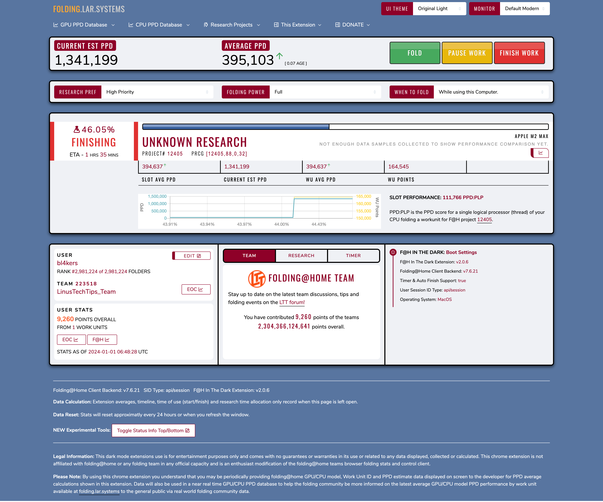
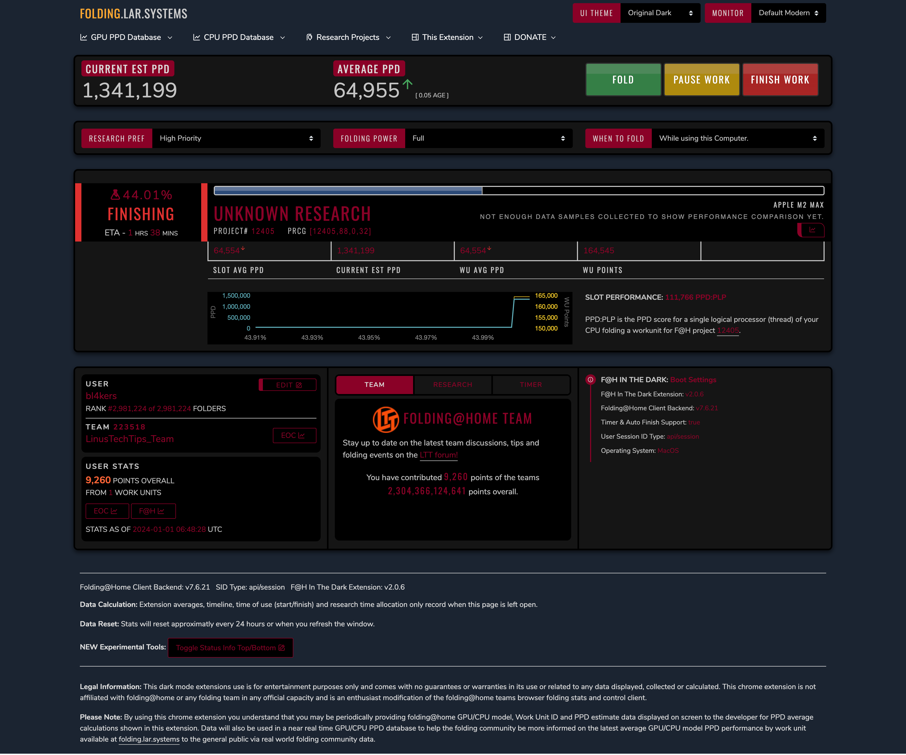

# FOLDING AT HOME IN THE DARK Themes

These are additional themes developed for the "FOLDING AT HOME IN THE DARK" browser extension.

<p align="center">
  
  
</p>

## Usage

1. Find the extension's [directory](https://stackoverflow.com/a/14544700)
1. Duplicate it
1. Add the `.css` files under `assets/css/team` to the same location in the duplicated directory
1. Update the `fah_custom.html` file to make the themes selectable
   1. Search for `box-theme-id`
   1. Locate this line:

      ```html
      <option value="assets/css/team/encom_os.css">Encom OS</option>
      ```

   1. After that line, add the following lines:

      ```html
      <option value="assets/css/team/original_light.css">Original Light</option>
      <option value="assets/css/team/original_dark.css">Original Dark</option>
      <option value="assets/css/team/original_dynamic.css">Original Dynamic</option>
      ```

    **Note:** These can be placed anywhere under the `<select>` tag

1. Update the `fah.js` file to ensure the "Team" section doesn't disappear

   1. Search for `function update_theme_style_rollover`
   1. Find this bit of code:

        ```js
        themestylecss == "" || themestylecss == undefined
        ```

   1. Replace it with this code:

        ```js
        ["", undefined].includes(themestylecss) || themestylecss.includes("original")
        ```

1. Open the [extensions manager](https://support.google.com/chrome_webstore/answer/2664769#cke_bm_1361S)
1. Enable "Developer Mode" in the top right corner
1. Find the existing extension installation and disable or remove it
1. Click the "Load Unpacked" button
1. Select your updated, duplicated directory

## Documentation

All themes have CSS variables declared at the top of their files. This makes them easy to tweak or duplicate to build your own theme.

It's worth noting that there have been tweaks to things like borders, box shadows, padding, and margin to achieve a look & feel similar to the original interface. Also, certain elements are grouped for coloring. These factors may make building your own theme more complicated than changing CSS variables, depending on your vision.

### Original Light

This is based on the original interface that can be seen when the aforementioned browser extension is not installed.

### Original Dark

This is a darkened version of Original Light.

### Original Dynamic

This relies on the [`prefers-color-scheme` CSS media feature](https://developer.mozilla.org/en-US/docs/Web/CSS/@media/prefers-color-scheme) to detect your light or dark preference. This is useful if you use any tools to change your theme based on the time of day.

## Links

- [extension](https://chromewebstore.google.com/detail/folding-at-home-in-the-da/alpjkkbjnbkddolgnicglknicbgfahoe)
- [Folding.LAR.systems](https://folding.lar.systems)
